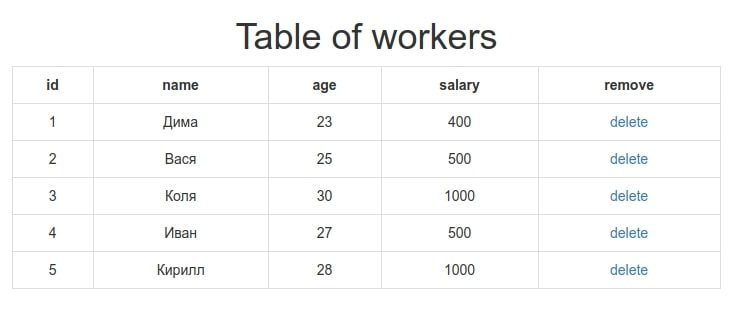

# NodeJS native with VueJS simple example

A simple nodejs server displays a list of workers in a table on the main page.
It is possible to delete an employee by clicking on the delete button in the table.

- [Vue.js](https://ru.vuejs.org/) is used to work with the client-side JS
- [axios.js](https://github.com/axios/axios) to send data to the server from the client

